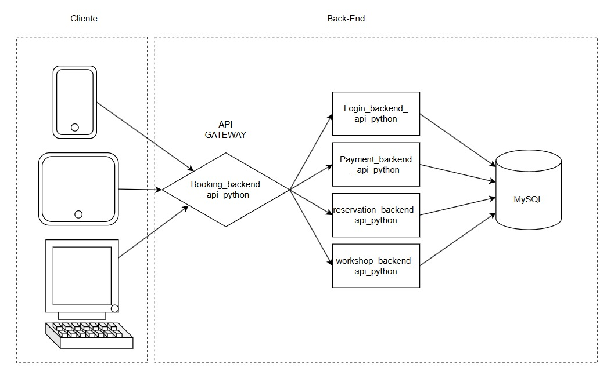
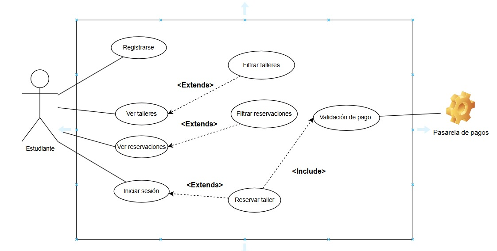

# MasterCook Academy - Gestión de Reservas para Clases y Talleres de Cocina  

## Introducción  
**MasterCook Academy** es una plataforma web diseñada para modernizar la gestión de reservas de talleres de cocina, reemplazando un sistema manual propenso a errores por una solución automatizada, escalable y eficiente. Este proyecto permite a los estudiantes explorar talleres disponibles, realizar reservas, simular pagos y gestionar sus clases, mientras que los administradores pueden controlar cupos, instructores y talleres de manera centralizada.  

La plataforma se desarrolló siguiendo una **arquitectura basada en microservicios**, utilizando tecnologías modernas como **Python + Flask** (backend), **React.js** (frontend), **MySQL** (base de datos) y **Docker** para la contenerización. Además, el sistema está desplegado en la nube, garantizando alta disponibilidad y escalabilidad.  

---

## Diagramas de Arquitectura y Casos de Uso  

### 1. Diagrama de Arquitectura  
El diagrama ilustra la estructura del sistema basada en microservicios, destacando:  
- Separación clara entre frontend, backend y base de datos.  
- Uso de contenedores Docker para cada servicio.  
- Comunicación entre los microservicios mediante APIs REST.  
- Integración con servicios externos (ej: simulación de pagos).  

  

### 2. Diagrama de Casos de Uso  
Este diagrama resume las interacciones principales de los usuarios con la plataforma:  
- Registro e inicio de sesión.  
- Exploración de talleres disponibles con filtros.  
- Reserva de talleres y simulación de pagos.  
- Visualización y gestión de reservas en "My Bookings".  

  

---

## Tecnologías Utilizadas  
- **Frontend**: React.js (interfaz dinámica y responsiva).  
- **Backend**: Python + Flask (APIs RESTful para gestión de datos).  
- **Base de Datos**: MySQL (almacenamiento estructurado de usuarios, talleres y reservas).  
- **Contenedores**: Docker (empaquetado y despliegue consistente).  
- **Despliegue**: Servicio en la nube (ej: Google Cloud Platform).  

---

## Estructura del Proyecto  
```plaintext
├── frontend/          # Aplicación React.js  
├── backend/           # Microservicios Flask  
├── docker-compose.yml # Configuración de contenedores  
├── database/          # Esquemas y scripts MySQL  
└── images/            # Diagramas de arquitectura y casos de uso  